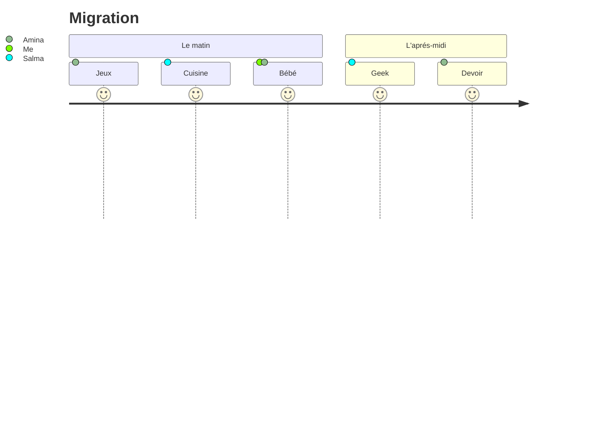
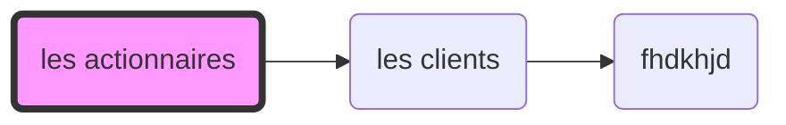

Digital Experience Score

# Requirements

# Assumptions

- The score is composed. Multiple intermediate scores are computed to obtain the final global score.\
 
- The engine is implementing non coupled / independant services for computing the intermediate scores (metrics ?)\
 
- We are able to reverse engineer the business rules from the engine and/or we have a team of functional expert skilled to producing the business rules\
 
- We only have to migrate from cloud to cloud (java old portal to the new portal) and no need to describe migration from pure on premise to cloud (can't see anything like this in the description)\
 

# Solutions

# Migration step proposition

1. Create a new portal that implements a subsets of the global score (MVP) - Rollout it in production. Add on option on existing app : View to see the new portal\
 
1. Successive deliveries to add other subsets of the global score\
 
1. When a critical number of subsets if develivered and rolled out, display the global score\
 
1. Communication to clients : from date XX.XX we will publish our new portal)\
 
1. Display by default the new portal on existing URL and allow switching to the old one if needed\
 
1. Communication - Change management to help migrating from on premise to cloud).\
 

# Organisation

## A frontend team
- build modern frontend and top UX
- Solve challenge related to SSE / websockets
    - Allow the user to activate or no the realtime engine
    - Provide a specific interface for big screens used in data center / call center / war rooms

## A backend team

- Strong business analysis to provide computation rules for metrics and score
- Strong IA team to do cross functional analysis and create IA models
- Strong BE dev team to replicate from Engine in memory DB to cloud nosql db (or read directly if direct querying does not affect the engine perf)
- Strong Backend dev team to build the implement rules for metrics and score
- Strong Backend dev team to produce data (based on extracts no Mongo - using pythons)

## Optional : cross functional teams

- New portal FE devs + designers / UX / CE + Backend dev team for business rules and metrics + business analysis + dev team for querying and/or db management + devops team for clustering / deployment / scaling

- IA team with FE devs + designers / UX / CE + Backend IA devs (python ext

- C'est trop cool

# Risks and mitigation actions

1. The business rules of the engine (to compute de metrics / score) cannot be retro-engineered and the knowlege is lost

    - New team of business analysts - start from scratch
    - Produce metrics and compare with existing - Iterates until the results are sufficiently close\
 

1. Querying the engine database has performance impacts (collectors or engine or portal)

    - Option 1 : Engine database replications
    - Option 2 : Double writing of the collectors in the dedicated instances\
 
1. Due to computation complexity and processing time, we can't ensure realtime responses

    - Choice of computing technology with self managed memory languages without GC (like C++ or Rust)

